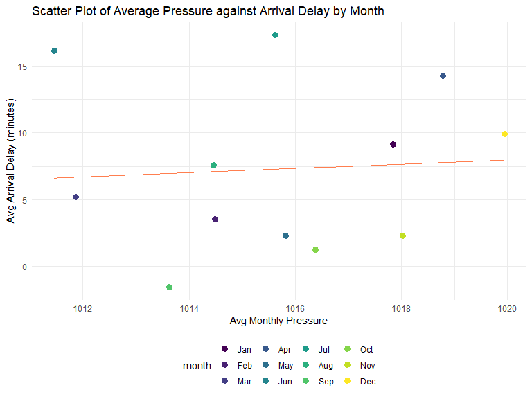

EDA
================
Si Chen
2023-12-04

``` r
library(tidyr)
library(tidyverse)
library(rvest)
library(dplyr)
library(cowplot)
library(gridExtra)

knitr::opts_chunk$set(
    echo = TRUE,
    warning = FALSE,
    fig.width = 8, 
  fig.height = 6,
  out.width = "90%"
)

theme_set(theme_minimal() + theme(legend.position = "bottom"))

options(
  ggplot2.continuous.colour = "viridis",
  ggplot2.continuous.fill = "viridis"
)

scale_colour_discrete = scale_colour_viridis_d
scale_fill_discrete = scale_fill_viridis_d
```

### Load clean datasets

``` r
df_2013 = 
  read_csv("data/merge_data_2013.csv", show_col_types = FALSE)

df_2017 = 
  read_csv("data/merge_data_2017.csv", show_col_types = FALSE)

# Convert month to factor with levels in ascending order and labels as month abbreviations
df_2013$month <- factor(df_2013$month, levels = 1:12, labels = month.abb[1:12])
```

### Data set description

In the dataset for 2013, there are 19 columns and 72734 rows. In the
dataset for 2017, there are 19 columns and 4785 rows.

# Weather

Visualize association between weather variables? aggregate by date, plot
scatter plot, add fitted line (instead of by month)?

``` r
# Aggregate the data by month and calculate averages
df_2013_avg <- df_2013 %>%
  group_by(month) %>%
  summarize(
    avg_arr_delay = mean(arr_delay, na.rm = TRUE),
    avg_precip = mean(precip, na.rm = TRUE),
    avg_wind_dir = mean(wind_dir, na.rm = TRUE),
    avg_wind_speed = mean(wind_speed, na.rm = TRUE),
    avg_wind_gust = mean(wind_gust, na.rm = TRUE),
    avg_pressure = mean(pressure, na.rm = TRUE),
    avg_visib = mean(visib, na.rm = TRUE)
  )
```

## Preciptation 2013

``` r
# Plot precipitation against arrival delay in a scatter plot
precip_delay = 
  ggplot(df_2013, aes(x = precip, y = arr_delay)) +
  geom_point(alpha = 0.5, color = "skyblue") +
  labs(title = "Scatter Plot of Precipitation against Arrival Delay",
       x = "Precipitation (inches)",
       y = "Arrival Delay (minutes)")
```

``` r
# Average precip against average arr_delay by month
precip_delay_month = 
  ggplot(df_2013_avg, aes(x = avg_precip, y = avg_arr_delay, color = month)) +
  geom_point(size = 3) +
  geom_smooth(method = "lm", se = FALSE, color = "coral", size = 0.6) +
  labs(title = "Scatter Plot of Precipitation against Arrival Delay",
       x = "Precipitation (inches)",
       y = "Arrival Delay (minutes)")
```

``` r
# grid.arrange(precip_line_bar, precip_delay, nrow = 2)
# precip_violin
# precip_line
# precip_bar
summary(df_2013$precip)
```

    ##     Min.  1st Qu.   Median     Mean  3rd Qu.     Max. 
    ## 0.000000 0.000000 0.000000 0.001352 0.000000 0.530000

``` r
precip_line_bar
```


``` r
precip_delay
```


``` r
precip_delay_month
```

    ## `geom_smooth()` using formula = 'y ~ x'


## Pressure

``` r
# Plot average pressure by month in line plot
pressure_line = 
  ggplot(df_2013, aes(x = month, y = pressure))  +  
  #geom_bar(aes(x=month, y=pressure),stat="summary", fun = 'mean', fill="skyblue")+ 
  geom_point(aes(x=month, y=pressure), stat = "summary", fun = "mean", color = "coral", alpha = .8) + 
  geom_line(aes(group = 1), stat="summary", fun = 'mean', color="skyblue", size=1, alpha = .8) + 
  labs(
    title= "Average Pressure by Month", 
    x="Month",
    y="Pressure")

# Plot Pressure against arrival delay in a scatter plot
pressure_delay = 
  ggplot(df_2013, aes(x = pressure, y = arr_delay)) +
  geom_point(alpha = 0.5, color = "skyblue") +
  labs(title = "Scatter Plot of Pressure against Arrival Delay",
       x = "Pressure",
       y = "Arrival Delay (minutes)")

# Average pressure against average arr_delay by month
pressure_delay_month = 
  ggplot(df_2013_avg, aes(x = avg_pressure, y = avg_arr_delay, color = month)) +
  geom_point(size = 3) +
  geom_smooth(method = "lm", se = FALSE, color = "coral", size = 0.6) +
  labs(title = "Scatter Plot of Average Pressure against Arrival Delay by Month",
       x = "Avg Monthly Pressure",
       y = "Avg Arrival Delay (minutes)")
```

``` r
summary(df_2013$pressure)
```

    ##    Min. 1st Qu.  Median    Mean 3rd Qu.    Max. 
    ##   983.8  1010.8  1015.4  1015.6  1020.4  1040.4

``` r
pressure_line
```


``` r
pressure_delay
```


``` r
pressure_delay_month
```

    ## `geom_smooth()` using formula = 'y ~ x'



## Visibility

``` r
# Plot average Visibility by month in line plot
visib_line = 
  ggplot(df_2013, aes(x = month, y = visib))  +  
  # geom_bar(aes(x=month, y=visib),stat="summary", fun = 'mean', fill="skyblue")+ 
  geom_point(aes(x=month, y=visib), stat = "summary", fun = "mean", color = "coral") + 
  geom_line(aes(group = 1), stat="summary", fun = 'mean', color="skyblue", size=1, alpha = .8) + 
  labs(
    title= "Average Visibility by Month", 
    x="Month",
    y="Visibility")

# Plot Visibility against arrival delay in a scatter plot
visib_delay = 
  ggplot(df_2013, aes(x = visib, y = arr_delay)) +
  geom_point(alpha = 0.5, color = "skyblue") +
  labs(title = "Scatter Plot of Visibility against Arrival Delay",
       x = "Visibility",
       y = "Arrival Delay (minutes)")

# Average Visibility against average arr_delay by month
visib_delay_month = 
  ggplot(df_2013_avg, aes(x = avg_visib, y = avg_arr_delay, color = month)) +
  geom_point(size = 3) +
  geom_smooth(method = "lm", se = FALSE, color = "coral", size = 0.6) +
  labs(title = "Scatter Plot of Average Visibility against Arrival Delay by Month",
       x = "Avg Monthly Visibility",
       y = "Avg Arrival Delay (minutes)")
```

``` r
summary(df_2013$visib)
```

    ##    Min. 1st Qu.  Median    Mean 3rd Qu.    Max. 
    ##   0.120  10.000  10.000   9.803  10.000  10.000

``` r
visib_line
```


``` r
visib_delay
```


``` r
visib_delay_month
```

    ## `geom_smooth()` using formula = 'y ~ x'


## Wind Direction

``` r
# Plot average wind_dir by month in line plot
wind_dir_line = 
  ggplot(df_2013, aes(x = month, y = wind_dir))  +  
  geom_bar(aes(x=month, y=wind_dir),stat="summary", fun = 'mean', fill="skyblue", alpha = .8)+ 
  geom_point(aes(x=month, y=wind_dir), stat = "summary", fun = "mean", color = "red") + 
  geom_line(aes(group = 1), stat="summary", fun = 'mean', color="coral", size=1, alpha = .9) + 
  labs(
    title= "Average Wind Direction by Month", 
    x="Month",
    y="Wind Direction")

# Plot Wind Direction against arrival delay in a scatter plot
wind_dir_delay = 
  ggplot(df_2013, aes(x = wind_dir, y = arr_delay)) +
  geom_point(alpha = 0.5, color = "skyblue") +
  labs(title = "Scatter Plot of Wind Direction against Arrival Delay",
       x = "Wind Direction",
       y = "Arrival Delay (minutes)")

# Average Wind Direction against average arr_delay by month
wind_dir_delay_month = 
  ggplot(df_2013_avg, aes(x = avg_wind_dir, y = avg_arr_delay, color = month)) +
  geom_point(size = 3) +
  geom_smooth(method = "lm", se = FALSE, color = "coral", size = 0.6) +
  labs(title = "Scatter Plot of Average Wind Direction against Arrival Delay by Month",
       x = "Avg Monthly Wind Direction",
       y = "Avg Arrival Delay (minutes)")
```

``` r
summary(df_2013$wind_dir)
```

    ##    Min. 1st Qu.  Median    Mean 3rd Qu.    Max. 
    ##    10.0   220.0   280.0   253.9   310.0   360.0

``` r
wind_dir_line
```


``` r
wind_dir_delay
```


``` r
wind_dir_delay_month
```

    ## `geom_smooth()` using formula = 'y ~ x'


## Wind Speed

``` r
# Plot average wind_speed by month in line plot
wind_speed_line = 
  ggplot(df_2013, aes(x = month, y = wind_speed))  +  
  geom_bar(aes(x=month, y=wind_speed),stat="summary", fun = 'mean', fill="skyblue", alpha = .8)+ 
  geom_point(aes(x=month, y=wind_speed), stat = "summary", fun = "mean", color = "red") + 
  geom_line(aes(group = 1), stat="summary", fun = 'mean', color="coral", size=1, alpha = .8) + 
  labs(
    title= "Average Wind Speed by Month", 
    x="Month",
    y="Wind Speed")

# Plot wind_speed against arrival delay in a scatter plot
wind_speed_delay = 
  ggplot(df_2013, aes(x = wind_speed, y = arr_delay)) +
  geom_point(alpha = 0.5, color = "skyblue") +
  labs(title = "Scatter Plot of Wind Speed against Arrival Delay",
       x = "Wind Speed",
       y = "Arrival Delay (minutes)")

# Average wind_speed against average arr_delay by month
wind_speed_delay_month = 
  ggplot(df_2013_avg, aes(x = avg_wind_speed, y = avg_arr_delay, color = month)) +
  geom_point(size = 3) +
  geom_smooth(method = "lm", se = FALSE, color = "coral", size = 0.6) +
  labs(title = "Scatter Plot of Average Wind Speed against Arrival Delay by Month",
       x = "Avg Monthly Wind Speed",
       y = "Avg Arrival Delay (minutes)")
```

``` r
summary(df_2013$wind_speed)
```

    ##    Min. 1st Qu.  Median    Mean 3rd Qu.    Max. 
    ##   4.603  12.659  16.111  16.523  19.563  39.127

``` r
wind_speed_line
```


``` r
wind_speed_delay
```


``` r
wind_speed_delay_month
```

    ## `geom_smooth()` using formula = 'y ~ x'


## Wind Gust

``` r
# Plot average wind_gust by month in line plot
wind_gust_line = 
  ggplot(df_2013, aes(x = month, y = wind_gust))  +  
  geom_bar(aes(x=month, y=wind_gust),stat="summary", fun = 'mean', fill="skyblue", alpha = .8)+ 
  geom_point(aes(x=month, y=wind_gust), stat = "summary", fun = "mean", color = "red") + 
  geom_line(aes(group = 1), stat="summary", fun = 'mean', color="coral", size=1, alpha = .8) + 
  labs(
    title= "Average Wind Gust by Month", 
    x="Month",
    y="Wind Gust")

# Plot wind_gust against arrival delay in a scatter plot
wind_gust_delay = 
  ggplot(df_2013, aes(x = wind_gust, y = arr_delay)) +
  geom_point(alpha = 0.5, color = "skyblue") +
  labs(title = "Scatter Plot of Wind Gust against Arrival Delay",
       x = "Wind Gust",
       y = "Arrival Delay (minutes)")

# Average wind_gust against average arr_delay by month
wind_gust_delay_month = 
  ggplot(df_2013_avg, aes(x = avg_wind_gust, y = avg_arr_delay, color = month)) +
  geom_point(size = 3) +
  geom_smooth(method = "lm", se = FALSE, color = "coral", size = 0.6) +
  labs(title = "Scatter Plot of Average Wind Gust against Arrival Delay by Month",
       x = "Avg Monthly Wind Gust",
       y = "Avg Arrival Delay (minutes)")
```

``` r
summary(df_2013$wind_gust)
```

    ##    Min. 1st Qu.  Median    Mean 3rd Qu.    Max. 
    ##   16.11   20.71   24.17   24.91   27.62   66.75

``` r
wind_gust_line
```


``` r
wind_gust_delay
```


``` r
wind_gust_delay_month
```

    ## `geom_smooth()` using formula = 'y ~ x'


# Flights

## Arrival Delay Summary

``` r
summary(df_2013$arr_delay)
```

    ##    Min. 1st Qu.  Median    Mean 3rd Qu.    Max. 
    ## -74.000 -16.000  -4.000   7.287  14.000 783.000

``` r
dd_hist = 
  ggplot(data = df_2013, aes(x = arr_delay)) +
  geom_histogram(fill = 'skyblue', color = 'coral')+
  labs(title = "Histogram of Arrival Delay",
       x = "Arrival Delay (minutes)",
       y = "Frequency")

dd_hist
```

    ## `stat_bin()` using `bins = 30`. Pick better value with `binwidth`.


## Arrival delay by origins

``` r
df_2013 %>%
  group_by(origin) %>%
  summarise(mean_ad = mean(arr_delay), sd_ad = sd(arr_delay), IQR_ad = IQR(arr_delay), n = n())
```

    ## # A tibble: 3 × 5
    ##   origin mean_ad sd_ad IQR_ad     n
    ##   <chr>    <dbl> <dbl>  <dbl> <int>
    ## 1 EWR       9.27  43.8     32 28344
    ## 2 JFK       6.39  40.8     29 19212
    ## 3 LGA       5.74  42.1     29 25178

``` r
# Plot violin plot of arr_delay against carrier, coloring by carrier
# reversing the order from high to low
delay_origin_box = 
  ggplot(df_2013, aes(x = reorder(origin, -arr_delay), y = arr_delay, fill = origin)) +
  geom_boxplot(trim = FALSE, scale = "width", alpha = 0.7) +
  labs(title = "Violin Plot of Arrival Delay by Origin",
       x = "Origin",
       y = "Arrival Delay (minutes)")

delay_origin_box
```


## Arrival delay by carriers

``` r
df_2013 %>%
  group_by(carrier) %>%
  summarise(mean_ad = mean(arr_delay), sd_ad = sd(arr_delay), IQR_ad = IQR(arr_delay), n = n())
```

    ## # A tibble: 16 × 5
    ##    carrier mean_ad sd_ad IQR_ad     n
    ##    <chr>     <dbl> <dbl>  <dbl> <int>
    ##  1 9E         8.29  45.5   34    3395
    ##  2 AA         1.45  43.0   30    7060
    ##  3 AS        -5.63  41.2   29     121
    ##  4 B6        10.1   40.3   30   10040
    ##  5 DL         1.27  39.2   26   10388
    ##  6 EV        16.7   48.1   41   12310
    ##  7 F9        22.4   61.0   34     189
    ##  8 FL        16.7   47.5   28     823
    ##  9 HA        -8.22  36.1   35.5    64
    ## 10 MQ        10.8   41.0   29    5999
    ## 11 OO        10     26.6   35       5
    ## 12 UA         3.59  39.8   28   13580
    ## 13 US         2.31  33.5   23    4629
    ## 14 VX         1.13  44.6   28     965
    ## 15 WN         8.69  43.7   30    3008
    ## 16 YV        21.4   57.1   54.8   158

``` r
# Plot violin plot of arr_delay against carrier, coloring by carrier
# reversing the order from high to low
delay_carrier_box = 
  ggplot(df_2013, aes(x = reorder(carrier, -arr_delay), y = arr_delay, fill = carrier)) +
  geom_violin(trim = FALSE, scale = "width", alpha = 0.7) +
  labs(title = "Violin Plot of Arrival Delay by Carrier",
       x = "Carrier",
       y = "Arrival Delay (minutes)")
delay_carrier_box
```


``` r
grid.arrange(delay_carrier_box, delay_origin_box, ncol = 2)
```


``` r
dd_hist
```

    ## `stat_bin()` using `bins = 30`. Pick better value with `binwidth`.


``` r
#delay_carrier_box
#delay_origin_box
```
