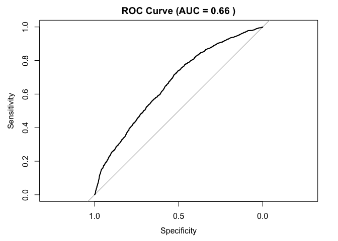
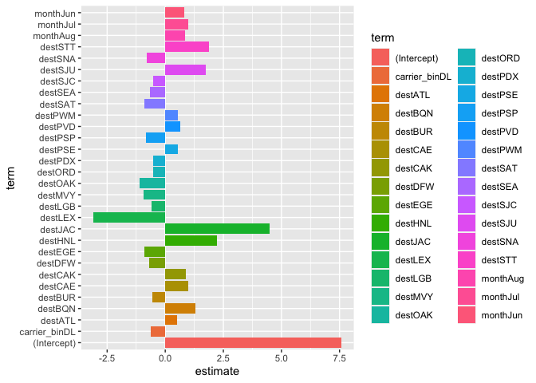

Prediction
================
Qi Yumeng
2023-12-05

# Load clean datasets

``` r
library(tidyverse)
```

    ## ── Attaching core tidyverse packages ──────────────────────── tidyverse 2.0.0 ──
    ## ✔ dplyr     1.1.3     ✔ readr     2.1.4
    ## ✔ forcats   1.0.0     ✔ stringr   1.5.0
    ## ✔ ggplot2   3.4.4     ✔ tibble    3.2.1
    ## ✔ lubridate 1.9.3     ✔ tidyr     1.3.0
    ## ✔ purrr     1.0.2     
    ## ── Conflicts ────────────────────────────────────────── tidyverse_conflicts() ──
    ## ✖ dplyr::filter() masks stats::filter()
    ## ✖ dplyr::lag()    masks stats::lag()
    ## ℹ Use the conflicted package (<http://conflicted.r-lib.org/>) to force all conflicts to become errors

``` r
library(tidymodels)
```

    ## ── Attaching packages ────────────────────────────────────── tidymodels 1.1.1 ──
    ## ✔ broom        1.0.5     ✔ rsample      1.2.0
    ## ✔ dials        1.2.0     ✔ tune         1.1.2
    ## ✔ infer        1.0.5     ✔ workflows    1.1.3
    ## ✔ modeldata    1.2.0     ✔ workflowsets 1.0.1
    ## ✔ parsnip      1.1.1     ✔ yardstick    1.2.0
    ## ✔ recipes      1.0.8     
    ## ── Conflicts ───────────────────────────────────────── tidymodels_conflicts() ──
    ## ✖ scales::discard() masks purrr::discard()
    ## ✖ dplyr::filter()   masks stats::filter()
    ## ✖ recipes::fixed()  masks stringr::fixed()
    ## ✖ dplyr::lag()      masks stats::lag()
    ## ✖ yardstick::spec() masks readr::spec()
    ## ✖ recipes::step()   masks stats::step()
    ## • Learn how to get started at https://www.tidymodels.org/start/

``` r
library(pROC)
```

    ## Type 'citation("pROC")' for a citation.
    ## 
    ## Attaching package: 'pROC'
    ## 
    ## The following objects are masked from 'package:stats':
    ## 
    ##     cov, smooth, var

``` r
df_2013_raw =  read_csv("data/merge_data_2013.csv", show_col_types = FALSE)
df_2017_raw = read_csv("data/merge_data_2017.csv", show_col_types = FALSE)

df_2013 = df_2013_raw |>
  mutate(if_delay = if_else(arr_delay >0,1,0),
         if_delay = factor(if_delay),
         carrier_bin = if_else(!(carrier %in% c('UA','EV','DL','B6')),'Others',carrier),
         month = factor(month,levels = 1:12, labels = month.abb[1:12])
         ) |>
  filter(!(dest %in% setdiff(unique(df_2013_raw$dest),unique(df_2017_raw$dest)))) |>
    select(-carrier,-tailnum,-arr_delay) 

df_2017 = df_2017_raw |>
  mutate(if_delay = if_else(arr_delay >0,1,0),
         if_delay = factor(if_delay),
         carrier_bin = if_else(!(carrier %in% c('UA','EV','DL','B6')),'Others',carrier),
         month = factor(month,levels = 1:12, labels = month.abb[1:12]))|>
  filter(!(dest %in% setdiff(unique(df_2017_raw$dest),unique(df_2013_raw$dest)))) |>
  select(-carrier,-tailnum,-arr_delay) 

# bool the target value
# bin the factor values with moderate amount of unique values
# drop some observations with too many of unique values
# there are over 100 unique values for 'dest', and each unique value accounts for around 5% or less, with a relatively even distribution,with filtering approach, we keep only the destinations that appear in both datasets and remove observations that are present in only one of the datasets.
# Convert month to factor with levels in ascending order and labels as month abbreviations
```

``` r
#skimr::skim(df_2013)
#skimr::skim(df_2017)
```

``` r
# Split data into train and test
set.seed(421)

train <- df_2013
test <- df_2017

# Train a logistic regression model
model <- logistic_reg(mixture = double(1), penalty = double(1)) %>%
  set_engine("glmnet") %>%
  set_mode("classification") %>%
  fit(if_delay ~ ., data = train)

# Model summary
tidy(model)
```

    ## Loading required package: Matrix

    ## 
    ## Attaching package: 'Matrix'

    ## The following objects are masked from 'package:tidyr':
    ## 
    ##     expand, pack, unpack

    ## Loaded glmnet 4.1-8

    ## # A tibble: 124 × 3
    ##    term        estimate penalty
    ##    <chr>          <dbl>   <dbl>
    ##  1 (Intercept) 15.8           0
    ##  2 originJFK    0.00281       0
    ##  3 originLGA   -0.0183        0
    ##  4 year         0             0
    ##  5 monthFeb    -0.231         0
    ##  6 monthMar    -0.271         0
    ##  7 monthApr     0.240         0
    ##  8 monthMay    -0.402         0
    ##  9 monthJun     0.137         0
    ## 10 monthJul     0.209         0
    ## # ℹ 114 more rows

``` r
# Class Predictions
pred_class <- predict(model,
                      new_data = test,
                      type = "class")

# Class Probabilities
pred_proba <- predict(model,
                      new_data = test,
                      type = "prob")
results <- test %>%
           dplyr::select(if_delay) %>%
           bind_cols(pred_class, pred_proba)


accuracy(results, truth = if_delay, estimate = .pred_class)
```

    ## # A tibble: 1 × 3
    ##   .metric  .estimator .estimate
    ##   <chr>    <chr>          <dbl>
    ## 1 accuracy binary         0.667

## Hyper-Tuning

``` r
# Split data into train and test
set.seed(421)

train = df_2013
test = df_2017

# Define the logistic regression model with penalty and mixture hyperparameters
log_reg <- logistic_reg(mixture = tune(), penalty = tune(), engine = "glmnet")
# We’ll set the penalty argument to tune() as a placeholder for now. This is a model hyperparameter that we will tune to find the best value for making predictions with our data. Setting mixture to a value of one means that the glmnet model will potentially remove irrelevant predictors and choose a simpler model.
# Define the grid search for the hyperparameters
grid <- grid_regular(mixture(), penalty(), levels = c(mixture = 4, penalty = 3))

# Define the workflow for the model
log_reg_wf <- workflow() %>%
  add_model(log_reg) %>%
  add_formula(if_delay ~ .)

# Define the resampling method for the grid search
folds <- vfold_cv(train, v = 5)

# Tune the hyperparameters using the grid search
log_reg_tuned <- tune_grid(
  log_reg_wf,
  resamples = folds,
  grid = grid,
  control = control_grid(save_pred = TRUE)
)
```

    ## → A | warning: Novel levels found in column 'dest': 'LEX'. The levels have been removed, and values have been coerced to 'NA'.

    ## There were issues with some computations   A: x1There were issues with some computations   A: x2There were issues with some computations   A: x3There were issues with some computations   A: x4There were issues with some computations   A: x4

``` r
select_best(log_reg_tuned, metric = "roc_auc")
```

    ## # A tibble: 1 × 3
    ##        penalty mixture .config              
    ##          <dbl>   <dbl> <chr>                
    ## 1 0.0000000001       1 Preprocessor1_Model10

## Evaluation Metrics

``` r
# Fit the model using the optimal hyperparameters
log_reg_final <- logistic_reg(penalty = 0.0000000001, mixture = 1) %>%
                 set_engine("glmnet") %>%
                 set_mode("classification") %>%
                 fit(if_delay~., data = train)

# Evaluate the model performance on the testing set
pred_class <- predict(log_reg_final,
                      new_data = test,
                      type = "class")
results <- test %>%
  dplyr::select(if_delay) %>%
  bind_cols(pred_class, pred_proba)

# Create confusion matrix
conf_mat(results, truth = if_delay,
         estimate = .pred_class)
```

    ##           Truth
    ## Prediction    0    1
    ##          0 2549  913
    ##          1  551  704

``` r
precision(results, truth = if_delay,
          estimate = .pred_class)
```

    ## # A tibble: 1 × 3
    ##   .metric   .estimator .estimate
    ##   <chr>     <chr>          <dbl>
    ## 1 precision binary         0.736

``` r
recall(results, truth = if_delay,
          estimate = .pred_class)
```

    ## # A tibble: 1 × 3
    ##   .metric .estimator .estimate
    ##   <chr>   <chr>          <dbl>
    ## 1 recall  binary         0.822

``` r
# Calculate AUC
roc_curve_results <- roc(results$if_delay, results$.pred_0)
```

    ## Setting levels: control = 0, case = 1

    ## Setting direction: controls > cases

``` r
auc_results <- auc(roc_curve_results)


# Assuming 'results' contains the predicted values and 'if_delay' contains the true values
# The 'results' data frame should have a column named '.pred' containing predicted values
# Plot ROC curve
plot(roc_curve_results, main = paste("ROC Curve (AUC =", round(auc_results, 2), ")"))
```

<!-- -->

``` r
coeff <- tidy(log_reg_final) %>% 
  arrange(desc(abs(estimate))) %>% 
  filter(abs(estimate) > 0.5)
ggplot(coeff, aes(x = term, y = estimate, fill = term)) + geom_col() + coord_flip()
```

<!-- -->
