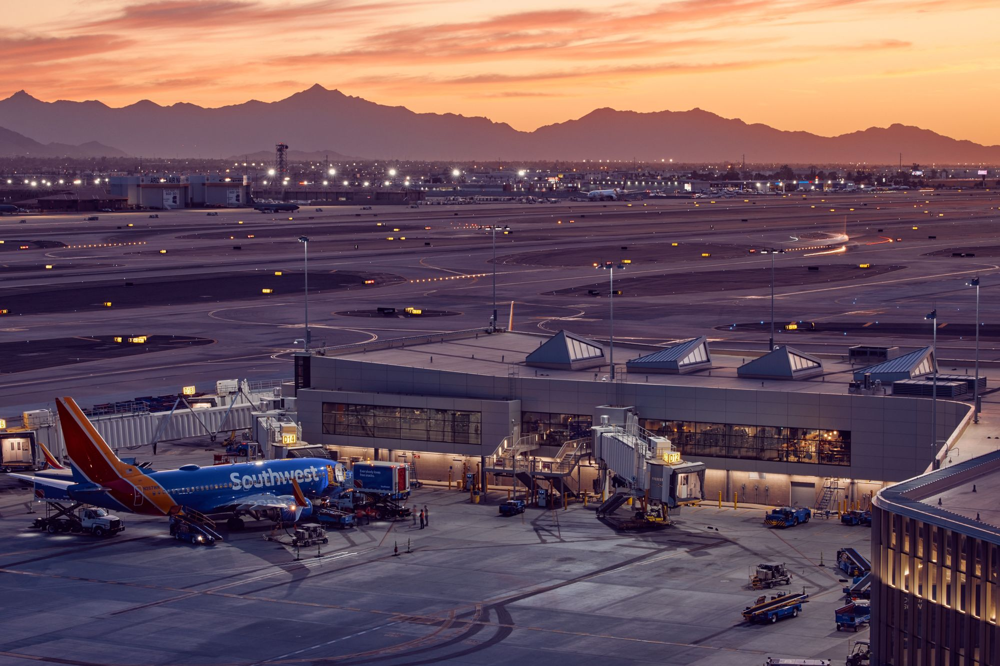

# Introduction

New York City, a global fusion of diverse culture and busy travel, is serviced by three major airports: John F. Kennedy International Airport (JFK), LaGuardia Airport (LGA), and Newark Liberty International Airport (EWR). These airports are not only pivotal in the United States' air traffic network but also play a significant role in international air travel. This report incorporates an in-depth predictive analysis of flight delays at these three airports, which reveal patterns and probabilities of such delays.This study seeks to provide a robust framework for predicting flight delays, and thus providing better planning and management guideline for passengers.

# Motivation

The airline industry is highly dependent on timely flight operations, and flight delays are a common concern for both passengers and airlines. Flight delays have far-reaching impacts, including not only economic costs for airlines but also inconvenience for passengers. Understanding and predicting these delays can lead to improving airlines efficiency and customer satisfaction. In addition, the New York City area's unique geographical and diverse cultural characteristics present an intriguing case for study. The region's congested airspace, fluctuated weather conditions, and intense flight schedules create an environment where delays are frequent. Analyzing this environment offers valuable insights into urban airport operations and delay management, potentially serving as a model for other major cities that share similar backgrounds as well. 

# Group Members
* Fangyi Chen, fc2718
* Jiying Wang, jw4489 
* Yumeng Qi, yq2378
* Si Chen, sc5126
* Yuxin Yin, yy3439

