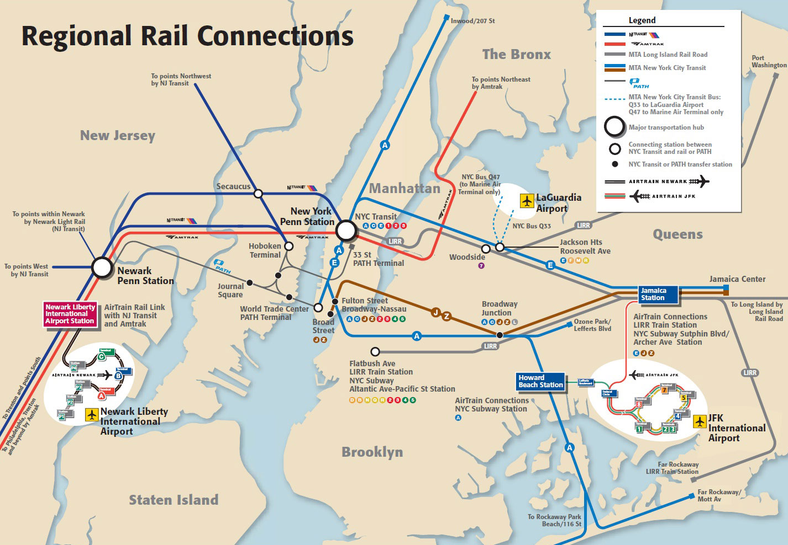
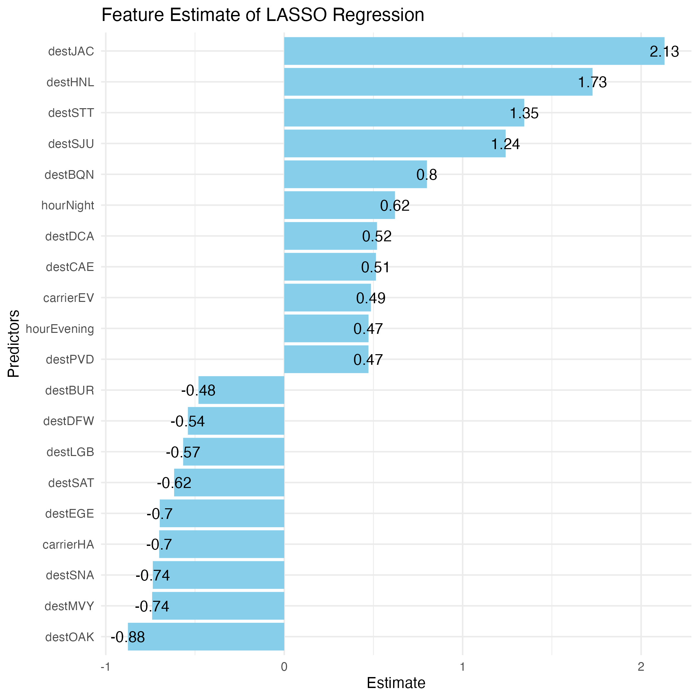
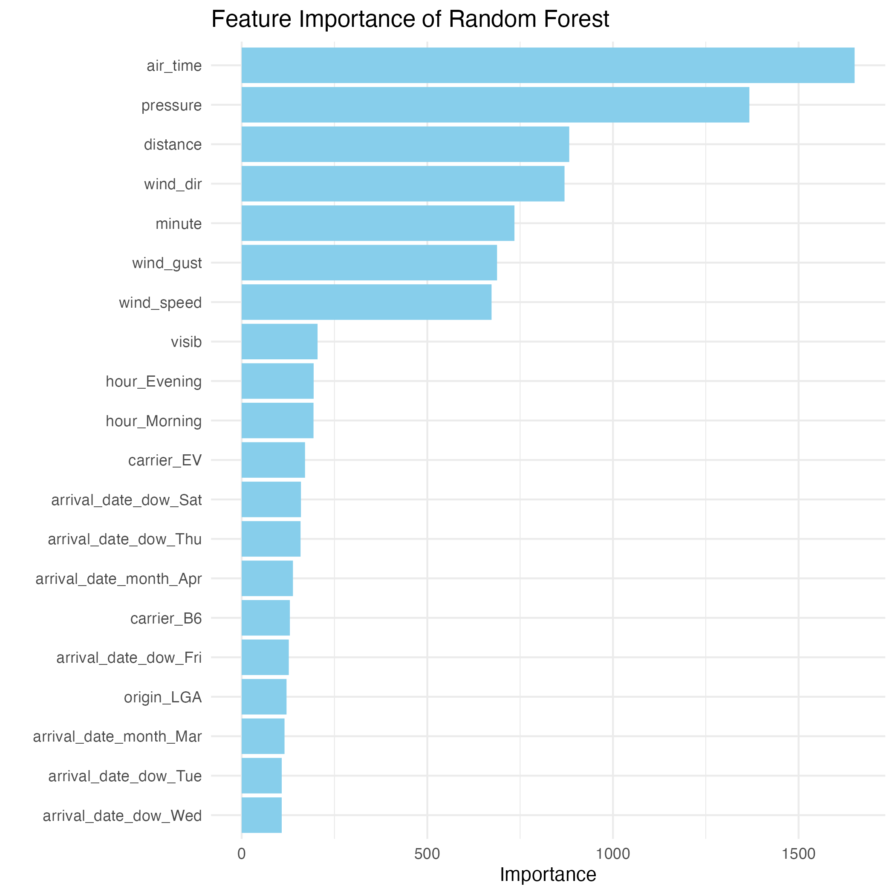

# Introduction

New York City, a global fusion of diverse culture and busy travel, is serviced by three major airports: John F. Kennedy International Airport (JFK), LaGuardia Airport (LGA), and Newark Liberty International Airport (EWR). These airports are not only pivotal in the United States' air traffic network but also play a significant role in international air travel. This report incorporates an in-depth predictive analysis of flight delays at these three airports, which reveal patterns and probabilities of such delays.This study seeks to provide a robust framework for predicting flight delays, and thus providing better planning and management guideline for passengers.

  

# Motivation

The airline industry is highly dependent on timely flight operations, and flight delays are a common concern for both passengers and airlines. Flight delays have far-reaching impacts, including not only economic costs for airlines but also inconvenience for passengers. Understanding and predicting these delays can lead to improving airlines efficiency and customer satisfaction. In addition, the New York City area's unique geographical and diverse cultural characteristics present an intriguing case for study. The region's congested airspace, fluctuated weather conditions, and intense flight schedules create an environment where delays are frequent. Analyzing this environment offers valuable insights into urban airport operations and delay management, potentially serving as a model for other major cities that share similar backgrounds as well. 

# Inspiration and Related Work

# Initial Questions

For the purpose of the project, we will be answering the following questions:  
- Which factors may build a model for predicting flight delays?  
- Does our model based on data from 2013 could be potentially used to predict flight delays in 2017?  
- Can our model be generalized based on the reults of the previous question.  

# Data

# Exploratory analysis

# Additional analysis

# Discussion

The objective of the study was to assess the correlation between flight delay duration and various flight-related factors using multiple linear regression. Additionally, the research aimed to forecast flight delays by employing a machine learning framework.

## Variable Selection

Lasso Regression and Random Forest models were applied to analyze the 2013 New York City flight dataset. The accompanying plots shed light on the 'variable importance.' On the right side, the top 20 absolute value estimates of Lasso Regression reveal a predominant presence of destination dummy variables. In contrast, the Random Forest plot on the left tells a distinct tale. Continuous variables such as airtime, pressure, distance, etc., play a more significant role in predicting delays compared to other categorical variables.

{width=45%}\hfill
{width=45%}

The difference in 'variable importance' between Lasso Regression and Random Forest models can be attributed to the inherent characteristics and mechanisms of each algorithm:

Lasso Regression (LR):

* Preference for Categorical Variables: LR performs variable selection by shrinking the coefficients of less influential variables to exactly zero. It tends to favor sparse solutions and is particularly effective when dealing with high-dimensional data.

Random Forest (RF):

* Ensemble of Decision Trees: RF builds an ensemble of decision trees, each trained on a random subset of the data and features. This ensemble approach allows the model to capture complex interactions and non-linear relationships.

* Handling Mixed Data Types: Unlike LR, RF is well-suited for handling both categorical and continuous variables simultaneously. It can effectively evaluate the importance of features with various data types.

* Robust to Collinearity: RF is less sensitive to multicollinearity, which means it can handle correlated features without necessarily discarding one of them. This can be advantageous when dealing with a mix of categorical and continuous variables.

## Model Performance

2017 New York City flight dataset was used for model evaluation. Notably, the Random Forest model exhibited superior performance across a majority of evaluation metrics. 

|                    | Sensitivity | Specificity | Pos Pred Value | Neg Pred Value | Precision | Recall | F1    | Prevalence | Detection Rate | Detection Prevalence | Balanced Accuracy |
|--------------------|-------------|-------------|-----------------|-----------------|-----------|--------|-------|------------|-----------------|-----------------------|---------------------|
| Logistic           | 0.880       | 0.470       | 0.759           | 0.673           | 0.759     | 0.880  | 0.815 | 0.655      | 0.577           | 0.760                 | 0.675               |
| RF     | 0.971       | 0.710       | 0.864           | 0.928           | 0.864     | 0.971  | 0.915 | 0.655      | 0.637           | 0.736                 | 0.841               |
 

Random Forest might outperform Lasso Regression in predicting flight delays for several reasons:

* Handling Non-linearity: Flight delay prediction is likely influenced by a combination of linear and non-linear factors. RF, being a non-linear model, can handle complex relationships and interactions more effectively than LR, which assumes a linear relationship between the predictors and the response variable.

* Feature Importance: RF inherently assesses the importance of different features in making predictions. This feature importance can be beneficial in scenarios where certain variables play a more crucial role in determining outcomes, and RF can adapt to this by giving more weight to those features. LR, while performing feature selection by shrinking some coefficients to zero, might not capture non-linear relationships or account for intricate feature interactions as comprehensively.

* Robustness to Outliers: RF is generally more robust to outliers and noisy data compared to LR. 
